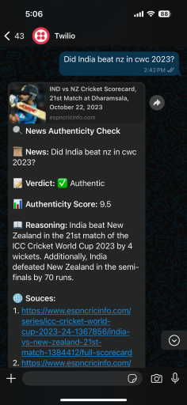
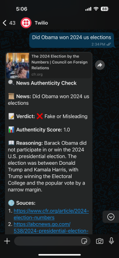

# 📢 News Credibility AI

News Credibility AI is an AI-powered fact-checking system that verifies the authenticity of news and claims. It leverages **FastAPI**, **Perplexity AI (Sonar LLM)**, and **Twilio WhatsApp API** to provide fact-checking services via a REST API and WhatsApp bot.

## 🚀 Features

- ✅ **Fact-Checking API**: Accepts user queries and evaluates their authenticity.
- 🔍 **Credibility Scoring**: Assigns a confidence score (1-10) based on verified sources.
- 📖 **Reasoning & Sources**: Provides explanations with supporting evidence.
- 🤖 **WhatsApp Integration**: Users can send news queries via WhatsApp for verification.
- 🌍 **Cross-Platform Availability**: Accessible via REST API and messaging platforms.

## How It Works

1. The user submits a news claim via WhatsApp.
2. The system fetches relevant sources and evaluates the claim.
3. It returns:
   - A **verdict** (✅ Authentic / ❌ Fake or Misleading)
   - An **authenticity score**
   - A **reasoning explanation**
   - Verified **sources**

## Scenarios

### ✅ Authentic News Example

Query: _"Did India beat NZ in CWC 2023?"_



**Verdict:** ✅ Authentic  
**Authenticity Score:** 9.5  
**Reasoning:** India beat New Zealand in the 21st match of the ICC Cricket World Cup 2023 by 4 wickets. They also defeated New Zealand in the semifinals by 70 runs.  
**Sources:** ESPN Cricinfo, Official Cricket Reports

---

### ❌ Fake or Misleading News Example

Query: _"Did Obama win 2024 US elections?"_



**Verdict:** ❌ Fake or Misleading  
**Authenticity Score:** 1.0  
**Reasoning:** Barack Obama did not participate in or win the 2024 U.S. presidential election. The election was contested between Donald Trump and Kamala Harris.  
**Sources:** CFR.org, ABC News

## 🛠️ Tech Stack

- **Backend**: FastAPI, Python
- **LLM**: Perplexity AI (Sonar LLM)
- **Messaging**: Twilio WhatsApp API
- **Deployment**: Render (FastAPI backend), Ngrok (for local testing)
- **Environment Variables**: Managed via `.env` file

## Installation & Setup

```bash
# Clone the repository
git clone https://github.com/your-repo/news-credibility-ai.git
cd news-credibility-ai

# Install dependencies
pip install -r requirements.txt

```

## Set Up Environment Variables

Create a `.env` file in the root directory and add:

```env
PERPLEXITY_API_KEY=your_perplexity_api_key
TWILIO_ACCOUNT_SID=your_twilio_account_sid
TWILIO_AUTH_TOKEN=your_twilio_auth_token
```

## Run the FastAPI Server

```bash
fastapi dev main.py
```

## Expose the API Publicly (For WhatsApp Integration)

```bash
ngrok http 8000
```

## How to Use

1. Deploy the FastAPI backend.
2. Configure Twilio API to connect with WhatsApp.
3. Send a message via WhatsApp to test the news verification feature.

Copy the **ngrok** HTTPS URL and update it in Twilio's Webhook settings.

## 🎯 Usage

### 🔹 Using the API

#### **Endpoint:** `/news-check`

```bash
curl -X POST "https://your-api-url.com/news-check" -H "Content-Type: application/json" -d '{"news": "Did DC defeat RCB in WPL?"}'
```

#### **Response Format:**

```json
{
  "is_authentic": true,
  "authenticity_score": 8.5,
  "reasoning": "The claim is verified by multiple news sources, including ESPN and BBC.",
  "sources": ["https://espn.com/news", "https://bbc.com/sports"]
}
```

### 🔹 Using WhatsApp Bot

- Send a message to **Twilio WhatsApp number** with a news query.
- Receive an authenticity check in response.
